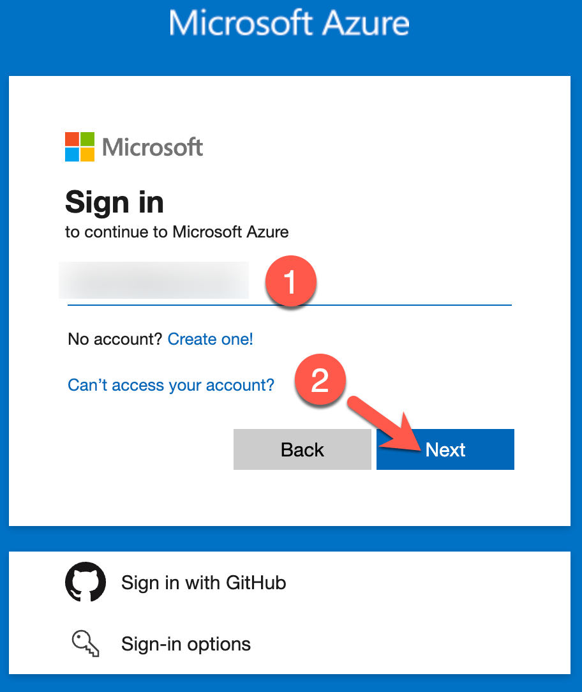
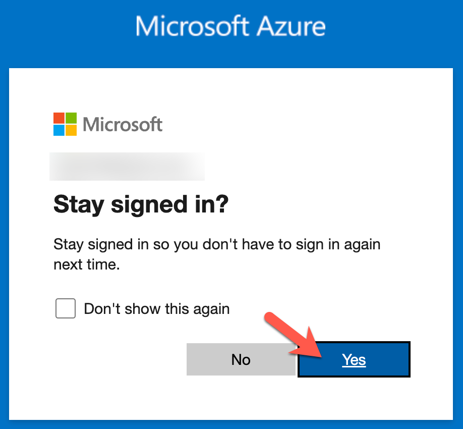
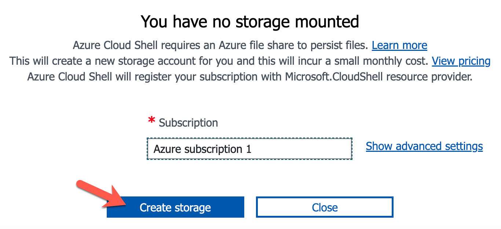

## DevNotes

### ToDo
- [ ] Create deployment script
- [ ] Create content for StorageAccount
- [ ] Create Sentinel Analytics rule 
- [ ] Write Objective text
- [ ] Write Exercise text
- [ ] Provide Screenshots

### Required from the student
- Azure Tenant
    - Should/can we link them to the sign-up page for a tenant?
- Separate subscription (?)
- "Main" user account
    - Assigned Roles
        - Global Administrator (?)

### Resource to be deployed
- Resource-Group 
- User
	- New "Victim" service principal
    	- Attributes should make it look like a storage service account
        - AD Roles assignments
            - `Reader` on the storage account
            - `Storage Blob Data Reader` on the storage account  
    - "Main" user account
        - AD Roles assignments
            - `Storage Blob Data Reader` on the storage account
- Storage Account
	- Blob Containers (hr-documents / secretdata)
		- Upload files/folders including HoneyFile 
- LogAnalyticsWorkspace
- Sentinel
	- Import deactivated Analytics Rule
	- Permission for Sentinel to run Automation
    	- `Microsoft Sentinel Automation Contributor` for `Azure Security Insights` on ResourceGroup


### To be configured by student in the lab
- Cloud Shell
- Metrics from StorageAccount to LogAnalytics	
- Automation in Sentinel to add Tasks to the incidient

-----

# Exercise 1: Deploying the Workshop Resources

**Estimated time to complete:** 15 minutes

## Objectives

* Log into AWS account and launch **CloudShell** session in the N. Virginia (**us-east-1**) region.
* Download source code using `git` from the workshop [GitHub repository](https://github.com/bluemountaincyber/building-detections-aws).
* Deploy workshop resources using AWS CloudFormation and verify resources were successfully created.

## Challenges

### Challenge 1: Launch AWS CloudShell

The exercises performed in this workshop are designed to simply use your web browser - no additional tools (e.g., virtual machines, SSH clients) required! Many cloud vendors allow customers to generate a shell session in a vendor-managed container/VM to perform basic tasks. We will use this to our advantage to deploy resources, perform attacks, and build our detections.

Begin by logging into your AWS account and launch a **CloudShell** session  in the **N. Virginia (us-east-1)** region.

??? cmd "Solution"

    1. Navigate to [https://console.aws.amazon.com](https://console.aws.amazon.com) and sign in with either your root user account or an IAM user with **AdministratorAccess** permissions.

        !!! note "Root User"

            Select the **Root user** radio button (1), enter your email address used to sign up for AWS in the **Root user email address** text field (2), and click the **Next** button (3). On the next page, enter your password in the **Password** text field (4) and click the **Sign in** button (5).

            {: class="w300" }
            {: class="w300" }

        !!! note "IAM User"

            Select the **IAM user** radio button (1), enter your AWS account number of alias in the **Account ID (12 digits) or account alias** text field (2), and click the **Next** button (3). On the next page, enter your IAM username in the **IAM user name** text field (4), enter your IAM user's password in the **Password** text field (5), and click on the **Sign in** button (6).

            {: class="w300" }
            {: class="w300" }

    2. When you arrive at the **AWS Management Console**, ensure that you are currently interacting with the **N. Virginia (us-east-1)** region by taking a look at the top-right of the page. You should see **N. Virginia**. If you see a different region, click the down arrow next to the region's name (1) and select **East US (N. Virginia** (2).

        {: class="w400" }

    3. Now that you are interacting with the **N. Virginia (us-east-1)** region, click on the icon near the top-right that looks like a command prompt to start a **CloudShell** session.

        {: class="w500" }

    4. On the next page, you will see a banner that states *Waiting for environment to run...*. Wait a minute or two until you see a command prompt that looks similar to `[cloudshell-user@ip-10-1-82-127 ~]$` (your hostname will vary).

        {: class="w500" }

    !!! note

        Your **CloudShell** session will expire after roughly 20 minutes of inactivity. If this happens, simply attempt to type and the session should resume. If this does not work, refresh the page.

### Challenge 2: Download Workshop Code

In order to rapidly set up some realistic targets in your environment that you will attack, as well as setup some of the more time-consuming resources to assist in the automated detection, there is some Infrastructure as Code (IaC) provided in [this GitHub repository](https://github.com/bluemountaincyber/building-detections-aws).

Now that you are in a **CloudShell** session, you will need to download this code in order to deploy these resources via AWS CloudFormation. But how to pull the code down to the session? That's easy! AWS provides `git` in their **CloudShell** environment!

??? cmd "Solution"

    1. Ensure that you are in your **CloudShell** session's home directory by running the following commands:

        ```bash
        cd /home/cloudshell-user
        pwd
        ```

        !!! summary "Expected Result"

            ```bash
            /home/cloudshell-user
            ```

    2. Use `git` to clone the **evidence-app** source code.

        ```bash
        git clone https://github.com/bluemountaincyber/building-detections-aws
        ```

        !!! summary "Expected result"

            ```bash
            Cloning into 'building-detections-aws'...
            remote: Enumerating objects: 215, done.
            remote: Counting objects: 100% (215/215), done.
            remote: Compressing objects: 100% (166/166), done.
            remote: Total 215 (delta 82), reused 179 (delta 46), pack-reused 0
            Receiving objects: 100% (215/215), 5.88 MiB | 17.70 MiB/s, done.
            Resolving deltas: 100% (82/82), done.
            ```

    3. Ensure that the code downloaded by running the following command:

        ```bash
        ls -la /home/cloudshell-user/building-detections-aws/
        ```

        !!! summary "Expected Result"

            ```bash
            drwxrwxr-x 5 cloudshell-user cloudshell-user 4096 Mar 17 14:54 .
            drwxr-xr-x 8 cloudshell-user cloudshell-user 4096 Mar 17 14:54 ..
            -rw-rw-r-- 1 cloudshell-user cloudshell-user 4720 Mar 17 14:54 BuildingDetections.yaml
            drwxrwxr-x 8 cloudshell-user cloudshell-user 4096 Mar 17 15:02 .git
            -rw-rw-r-- 1 cloudshell-user cloudshell-user   24 Mar 17 14:54 .gitignore
            drwxrwxr-x 2 cloudshell-user cloudshell-user 4096 Mar 17 15:02 scripts
            drwxrwxr-x 3 cloudshell-user cloudshell-user 4096 Mar 17 14:55 workbook
            ```

### Challenge 3: Deploy Workshop IaC Resources

Finally, you have all of the components needed to deploy the resources in your AWS account.

Use `build.sh` to deploy the IaC (which can be found in the `scripts` directory of the repo you just downloaded). Ensure that all worked properly by searching for the following AWS resources using the AWS CLI (also provided in CloudShell):

- [ ] A honey file named `password-backup.txt`
- [ ] An S3 bucket with a name beginning with `databackup-` with a honey file placed inside called `password-backup.txt`
- [ ] Lambda function named `HoneyFileDetection`
- [ ] Security Hub is successfully deployed

!!! warning

    If you already have Security Hub setup in your AWS account within the N. Virginia region (us-east-1), your deployment will fail. The failure will look like this:

    !!! summary "Failed deployment"

        ```bash
        Failed to create/update the stack. Run the following command
        to fetch the list of events leading up to the failure
        aws cloudformation describe-stack-events --stack-name building-detections
        ```
    
    If that happens, you can run the following commands after this failure and try again:

    ```bash
    aws cloudformation delete-stack --stack-name building-detections
    aws securityhub disable-security-hub
    ```

??? cmd "Solution"

    1. Run the `build.sh` script located in the `/home/cloudshell-user/building-detections-aws/scripts` directory. After roughly 2 minutes, it should complete.

        ```bash
        /home/cloudshell-user/building-detections-aws/scripts/build.sh
        ```

        !!! summary "Sample Result"

            ```bash
            Waiting for changeset to be created..
            Waiting for stack create/update to complete
            Successfully created/updated stack - building-detections
            ```

    2. Now, check that the resources listed above were deployed properly.

        - S3 bucket beginning with the name `databackup-` and its contents

            ```bash
            BUCKET=$(aws s3api list-buckets | jq -r '.Buckets[] | select(.Name | startswith("databackup-")) | .Name')
            aws s3 ls | grep $BUCKET
            aws s3 ls s3://$BUCKET/
            ```

            !!! summary "Sample result"

                ```bash
                2023-03-25 15:35:22 databackup-123456789010
                2023-03-25 15:36:20         91 password-backup.txt
                ```

        - Lambda function named `HoneyFileDetection`

            ```bash
            aws lambda get-function --function-name HoneyFileDetection --query Configuration.FunctionArn --output text
            ```

            !!! summary "Sample result"

                ```bash
                arn:aws:lambda:us-east-1:123456789010:function:HoneyFileDetection
                ```

        - Security Hub is successfully deployed

            ```bash
            aws securityhub describe-hub --query HubArn --output text
            ```

            !!! summary "Sample result"

                ```bash
                "arn:aws:securityhub:us-east-1:123456789010:hub/default"
                ```

## Conclusion

Now that you have the resources in place, it's time to **set up logging** in the next exercise!
