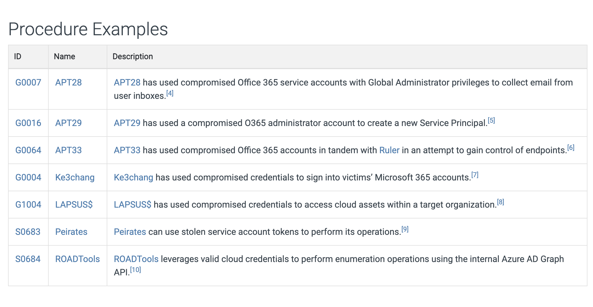
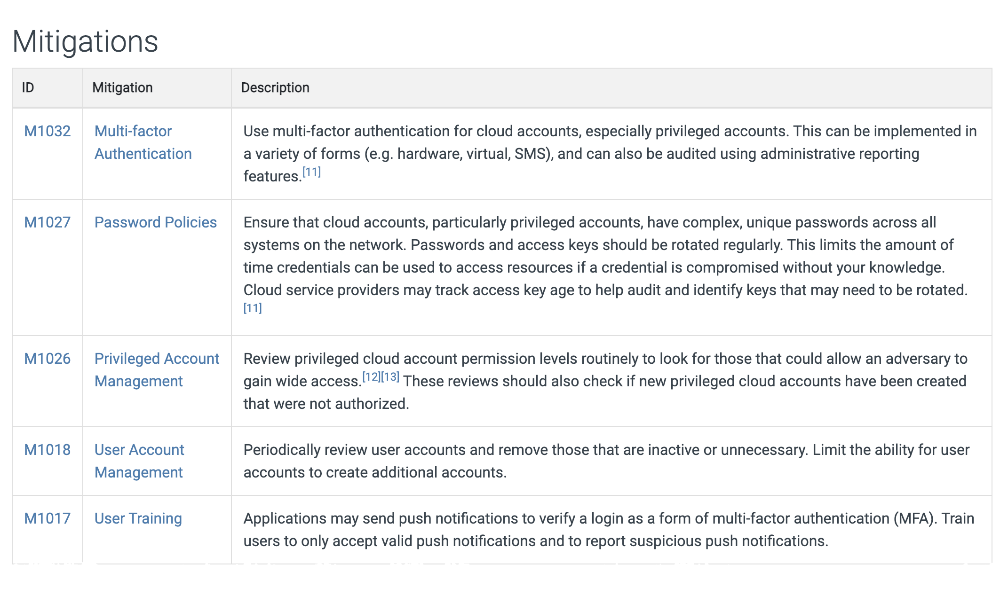

## DevNotes

### ToDo
- [X] Write Objective text
- [x] Write Exercise text
- [ ] ~~Provide Commands / Scripts~~
- [ ] Provide Screenshots

-----

# Exercise 2: Configuring Logging

<!-- markdownlint-disable MD007 MD033-->

<!--Overriding style-->

**Estimated Time to Complete:** 15 minutes

## Objectives

* Research ATT&CK Technique T1078.004 detections and discover an approach to use in your Azure tenant
* Configure logging of blob storage operations and shipping to Log Analytics workspace

## Challenges

### Challenge 1: Research ATT&CK Technique T1078.004 Detections

Review [MITRE ATT&CK Technique T1078.004](https://attack.mitre.org/techniques/T1078/004/) to see how real-world adversarial groups have leveraged cloud access to further their attack campaigns. Near the bottom of the page, you will find some approaches to detect this behavior. Using the resources we have available in Azure, how could we detect a stolen credential? Could we use deception?

??? cmd "Solution"

    1. Navigate to the [MITRE ATT&CK Technique T1078.004](https://attack.mitre.org/techniques/T1078/004/) page.

    2. The first few paragraphs explain how cloud accounts can be leveraged by an attacker to access, manipulate, or even damage cloud resources.

        {: class="w600" }

    3. In the **Procedure Examples**, you will see the known threat groups that have used this technique and how it was used to their advantage.

        {: class="w600" }

    4. The **Mitigations** section shows how we, as defenders, can limit the attacker's chances of using this technique.

        {: class="w600" }

    5. Finally, the **Detection** section shows some techniques to discover this behavior in a cloud environment. 

        {: class="w600" }
    
    6. We are going to think outside the box a bit and leverage a **honey file** that was created in the last lab. Honey files simply fake bits of data that we place in key locations of our organization and, if they are accessed, we detect and immediately respond as the attacker has made their presence known. But how do we monitor and detect this?

### Challenge 2: Configure logging and forwarding of blob storage events

To be able to track usage of a honey file, we must monitor when it is accessed. This is done by creating a diagnostic setting on our blob storage resource.

A diagnostic setting - in Microsofts own words - "specifies a list of categories of platform logs and/or metrics that you want to collect from a resource, and one or more destinations that you would stream them to".

In our case we could make due with only the `StorageRead` log category, but let us collect all the logs and metrics of this resource so we can see everything that is happening. To make searching and alerting on those events easier, we will send them into a Log Analytics workspace. Let´s configure this via the Azure Portal GUI.

??? cmd "Solution"

    1. From the Azure Portal homepage, navigate to the storage account service and select the workshop storage account. Should you not see the storage account, make sure that no filter is applied for `Subscription`, `Resource group`, and `Location`.
    <!---ALEX:$SCREENSHOT--->

    2. With the storage account selected, navigate to the `Monitoring` section on the left sidebar and select the `Diagnostic settings` blade. Clicking on the line with the `blob` resource in the main pane will bring you to the diagnostic settings of the blob, which should be empty at this stage of the workshop.
    <!---ALEX:$SCREENSHOT--->

    3. Click the `Add diagnostic setting` link and you will be prompted to supply a `Diagnostic setting name`, a selection of what Logs/Metrics should be collected, and the destination for said Logs/Metrics.
    <!---ALEX:$SCREENSHOT--->

    4. We select all logs and metrics, and want them being send to our `Log Analytics workspace`. For the name, `AllEvents-LogAnalytics` should suffice. After pressing the `Save` button on the upper left corner you will be brought back to the Diagnostic settings view showing that we successfully configured our log collection.
    <!---ALEX:$SCREENSHOT--->

## Conclusion

You are now logging and forwarding all events for this particular blob storage. In the next exercise, you will verify that the log and forwarding is working by accessing the honey file.
